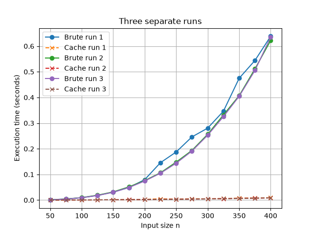
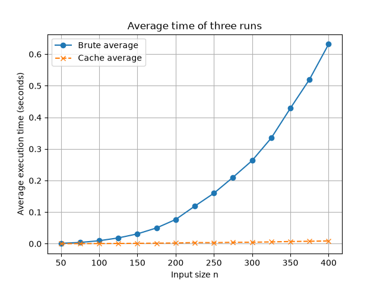
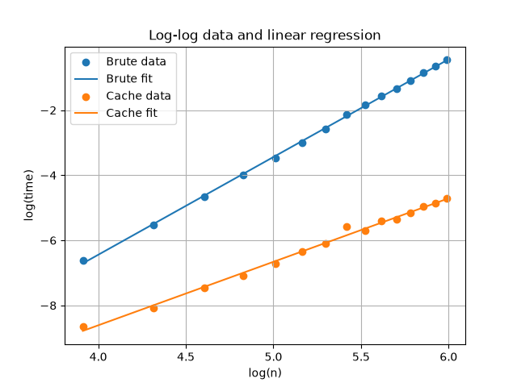

# Del 1 - Utvärdering av 3-sum-algoritmer

## 1. Hur experimenten genomfördes

Jag använde mig av två stycken algoritmer för 3-sum-probleme, en brute-force lösning och en cachnings lösning. Båda funktionerna använder `sum = 0` och returnerar unika triples som tuples. Varje triple sorteras innan den sparas, och ett set används för att förhindra att samma triple läggs till flera gånger.

Jag testade jag hur väl lösningarna stämde med tre slumpmässigt genererade listor som innehöll 15 tal vardera. Talen genererades i intervallet $[-10n, 10n]$, vilket blir $[-150, 150]$ i dessa tester. Resultaten från brute-force, och cachning sorterades och jämfördes. Alla tre tester returnerade samma triple sets.

För prestandaexperimentet användes 15 olika inputstorlekar:

```text
50, 75, 100, ..., 400
```

För varje inputstorlek kördes båda algoritmerna tre gånger på slumpmässigt genererade listor. Tiden mättes med Pythons `time.perf_counter()`.

## 2. Resultat och jämförelse

Testerna visade att båda implementationerna ger samma resultat. I testerna hittade båda algoritmerna:

```text
Test 1:
Lista: [-20, 137, -7, 69, -132, -139, -18, -103, -43, 21, 145, -110, -34, -48, -31]
Brute: [(-103, -34, 137)]
Cache: [(-103, -34, 137)]
Samma resultat: True

Test 2:
Lista: [-115, 109, -68, 60, -82, -110, 17, -109, 73, -86, 43, 84, 26, 79, 78]
Brute: [(-110, 26, 84), (-86, 26, 60)]
Cache: [(-110, 26, 84), (-86, 26, 60)]
Samma resultat: True

Test 3:
Lista: [121, 66, -75, 119, -70, 89, 100, -42, -132, 32, 56, 149, -43, 122, 106]
Brute: [(-132, 32, 100)]
Cache: [(-132, 32, 100)]
Samma resultat: True
```

Brute-force blir dock mycket långsammare när inputstorleken ökar. Dess log-log-regression gav:

```text
k = 3.0030
```

Medans caching-algoritmen växer långsammare och log-log-regression gav:

```text
k = 1.9507
```

Caching är därför mer effektivt än brute force för större inputlistor. De exakta tiderna varierar mellan körningarna eftersom inputlistorna är slumpmässiga och datorn kan utföra annat arbete under mätningen.

Bild 1 visar de tre separata körningarna och hur tiderna varierar mellan körningarna.



Bild 1a visar medelvärdet av de tre körningarna för varje inputstorlek.



Bild 2b visar log-log-data och de raka linjerna från den linjära regressionen. Lutningen på linjen motsvarar koefficienten $k$.



## 3. Matematisk förklaring

### Brute force

Brute-force-algoritmen använder tre nästlade loopar. Antalet testade kombinationer är:

$$
\binom{n}{3} = \frac{n(n-1)(n-2)}{6}
$$

Antalet kombinationer växer ungefär som $n^3$ när listan blir större. Därför har brute-force-algoritmen komplexiteten:

$$
T(n) = O(n^3)
$$

### Caching

Caching-algoritmen väljer det första värdet med en loop. För varje första värde går den igenom de återstående värdena med en andra loop. Det tredje värdet som behövs beräknas direkt:

$$
v_3 = 0 - v_1 - v_2
$$

Uppslagningen `v_3 in cache` tar i genomsnitt konstant tid, $O(1)$. Det finns två loopar som vardera bidrar med ungefär $n$ operationer:

$$
T(n) = O(n) \cdot O(n) = O(n^2)
$$

Log-log-metoden utgår från:

$$
t(n) \approx c n^k
$$

Om man tar logaritmen på båda sidor får man:

$$
\log(t) = \log(c) + k\log(n)
$$

Efter att $\log(t)$ plottats mot $\log(n)$ uppskattar lutningen från den linjära regressionen värdet på $k$. De uppmätta lutningarna var ungefär $3.00$ för brute force och $1.95$ för caching.

## 4. Hur caching-metoden fungerar

För varje första värde `value1` skapar algoritmen ett tomt set som kallas `cache`. Därefter undersöks varje senare värde `value2`, och värdet som behövs för att summan ska bli noll beräknas:

```python
value3 = sum - value1 - value2
```

Om `value3` redan finns i `cache` har en giltig triple hittats. Det aktuella `value2` läggs till i cache efter uppslagningen. Denna ordning är viktig eftersom den förhindrar att samma listposition används två gånger.

Om exempelvis `value1 = -3` och `value2 = 0` är det önskade värdet:

$$
value3 = 0 - (-3) - 0 = 3
$$

Om `3` redan har setts läggs triplen `(-3, 0, 3)` till. Genom att sortera triplen och spara den i ett set räknas olika ordningar av samma värden som ett enda unikt triple set.
