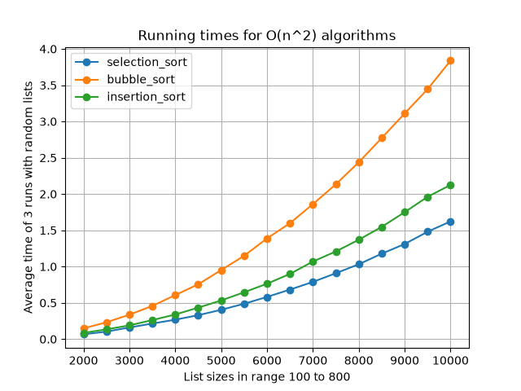
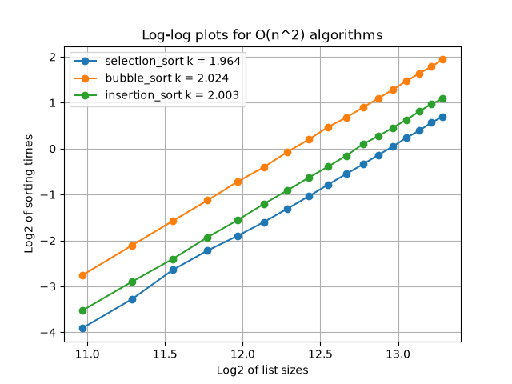

# Del 1 - Utvärdering av 3-sum-algoritmer

## 1. Hur experimenten genomfördes

Jag testade tre sorteringsalgoritmer: selection sort, bubble sort och insertion sort.

Jag genererade 17 olika liststorlekar, från 2000 till 10000 tal, i steg om 500. Listorna innehöll slumpmässiga tal.

För varje storlek kördes alla tre algoritmerna tre gånger, och tiden mättes med Pythons `time.perf_counter()`. Medelvärdet av de tre körningarna användes sedan i resultaten.

Jag gjorde också en log-log-analys. Både liststorlekarna och tiderna logaritmerades, och en rät linje anpassades till punkterna. Lutningen på linjen (k) visar exponenten i tidskomplexiteten, och för alla tre algoritmer blev k nära 2 (mellan 1,96 och 2,02), vilket bekräftar att de är O(n²).

## 2. Resultat och jämförelse

Av de tre algoritmerna var selection sort snabbast genomgående, följt av insertion sort, medan bubble sort var långsammast.

Skillnaden beror på hur många operationer varje algoritm faktiskt gör, inte bara att de alla är O(n²):

- **Bubble sort** byter plats på element väldigt ofta, eftersom den jämför och byter grannar hela tiden under sorteringen. Många swaps gör den till den långsammaste av de tre.
- **Selection sort** gör lika många jämförelser som bubble sort, men bara en swap per varv i ytterloopen.
- **Insertion sort** ligger mellan de två. Med slumpmässig data får den ungefär lika många jämförelser och förflyttningar som selection sort, men blir lite långsammare eftersom den flyttar element ett i taget istället för att göra en swap.

Alla tre algoritmerna växer i samma takt, vilket syns i bilden genom att kurvorna har liknande form.

## 3. Matematisk förklaring
Att en algoritm är O(n²) innebär att körtiden kan skrivas som:

$$
T(n) = c \cdot n^2
$$

där $c$ är en konstant. Tar man logaritmen av båda sidor får man:

$$
\log(T(n)) = \log(c) + 2\log(n)
$$

Detta är ekvationen för en rät linje, där lutningen är $k = 2$ (exponenten i $n^2$) och skärningen med y-axeln är $\log(c)$.

Genom att plotta $\log_2(\text{liststorlek})$ mot $\log_2(\text{körtid})$ för varje algoritm, och anpassa en rät linje till punkterna med minsta kvadratmetoden (`lin_reg`), fick jag ut lutningen $k$ för varje algoritm:

- selection_sort: $k = 1{,}964$
- bubble_sort: $k = 2{,}024$
- insertion_sort: $k = 2{,}003$

Eftersom alla tre värden ligger mycket nära $2$ (se Figur 2), bekräftar det att algoritmerna följer $O(n^2)$ i praktiken, precis som den teoretiska tidskomplexiteten förutsäger.

## 4. Hur algoritmerna funkar

### Selection Sort

Ytterloopen (current_index) går igenom listan nummer för nummer.

- För varje position antar vi att talet där är det minsta hittills.
- Innerloopen (compare_index) går igenom resten av listan, från nästa position och framåt, och letar efter ett tal som är mindre. Hittas ett mindre tal, uppdateras index_of_smallest_value till den positionen.
- När innerloopen är klar vet vi var det minsta talet i den osorterade delen finns. Då byter vi plats (swap) på det talet och talet på current_index.
- Varje gång ytterloopen kör ett varv, blir ett tal till klart och hamnar på rätt plats i listan. Så listan byggs upp bit för bit, från vänster till höger.

### Bubble Sort

Vi jämför två grannar i taget (current_index och current_index + 1).

- Är det vänstra talet större än det högra, byter vi plats på dem.
- Vi går igenom hela listan på det sättet en gång. Det gör att det största talet "bubblar" hela vägen till slutet, eftersom det byter plats med allt mindre än sig själv varje gång det jämförs.
- Ytterloopen (iteration_count) upprepar det här flera gånger. För varje varv behöver vi kolla en position mindre (length - iteration_count - 1), eftersom de sista positionerna redan är klara.

### Insertion Sort

Du går igenom listan ett tal i taget, från vänster till höger.

- För varje tal du kommer till (current_value) frågar du: var i det du redan gått igenom hör det här talet hemma?
- Du kollar bakåt, ett steg i taget. Så länge talet bakom (till vänster) är större än ditt tal, flyttar du det steget åt höger och fortsätter bakåt (while-loopen).
- Så fort du hittar ett tal som är mindre, eller du når slutet, är du framme – där sätter du in current_value.
- Effekten blir att allt du redan gått igenom (till vänster om current_index) alltid är sorterat sinsemellan, även om det inte är på sin slutgiltiga plats än. Ju längre du kommer i listan, desto större blir den sorterade biten.