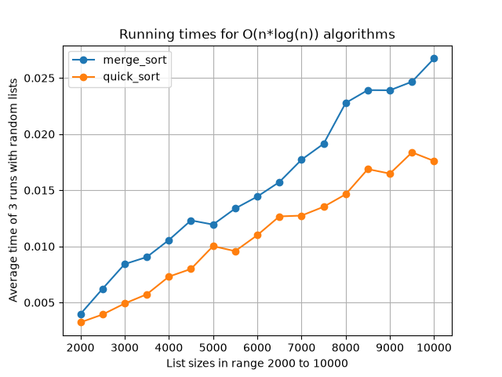
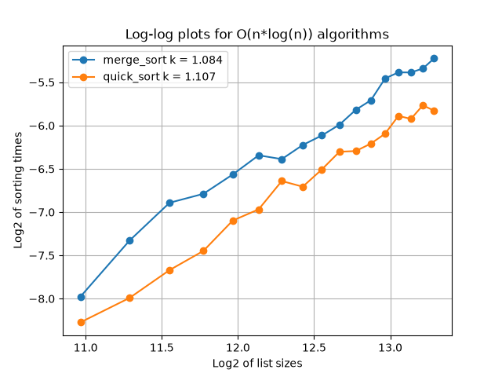

# Del 2 - Utvärdering av nlogn-algoritmer

## 1. Hur experimenten genomfördes

Jag testade två sorteringsalgoritmer, merge sort och quick sort.

Jag genererade 17 olika liststorlekar, från 2000 till 10000 tal, i steg om 500. Listorna innehöll slumpmässiga tal.

För varje storlek kördes båda algoritmerna tre gånger, och tiden mättes med Pythons `time.perf_counter()`. Medelvärdet av de tre körningarna användes sedan i resultaten.

Jag gjorde också en log-log-analys. Både liststorlekarna och tiderna logaritmerades, och en rät linje anpassades till punkterna med minsta kvadratmetoden.

## 2. Resultat och jämförelse

Merge sort och quick sort presterade mycket lika i experimentet, med quick sort lite snabbare än merge sort.

Att de ligger så nära varandra är rimligt eftersom båda delar upp problemet rekursivt (dela och härska) och gör ungefär lika många operationer totalt. Quick sort slipper det extra steget att skapa nya listor vid sammanslagning (`merge`), vilket kan förklara skillnaden.

## 3. Matematisk förklaring

Att en algoritm är O(n·log(n)) innebär att körtiden kan skrivas som:

$$
T(n) = c \cdot n \cdot \log(n)
$$

där $c$ är en konstant. Tar man logaritmen av båda sidor får man:

$$
\log(T(n)) = \log(c) + \log(n) + \log(\log(n))
$$

Detta liknar ekvationen för en rät linje med lutningen $1$, plus en extra term $\log(\log(n))$ som växer väldigt långsamt. Om man skattar en rät linje till punkterna, som med `lin_reg`, förväntas lutningen $k$ därför ligga strax över $1$ — betydligt lägre än de $k \approx 2$ som gällde för n²-algoritmerna.

Genom att plotta $\log_2(\text{liststorlek})$ mot $\log_2(\text{körtid})$ för varje algoritm, och anpassa en rät linje till punkterna med minsta kvadratmetoden (`lin_reg`), fick jag ut lutningen $k$ för varje algoritm:

- merge_sort: $k = 1{,}084$
- quick_sort: $k = 1{,}107$

Båda värdena ligger nära $1$, vilket stämmer väl överens med teorin. Skillnaden mot exakt $1$ förklaras av $\log(\log(n))$-termen, som ger en liten extra lutning inom det testade intervallet (se Figur 2).

## 4. Hur algoritmerna funkar

### Merge Sort

- Listan delas på mitten i en vänster- och en högerdel (left_side och right_side).
- Varje del skickas in i samma funktion igen (merge_sort anropar sig själv), vilket fortsätter tills delarna bara innehåller ett tal var. En lista med ett tal räknas alltid som sorterad.
- När två sorterade delar ska sättas ihop igen (merge) jämförs det första talet i varje del med varandra. Det minsta av dem läggs till i den nya listan, sen går man vidare till nästa tal.
- Detta upprepas tills alla tal i båda delarna är tillagda.
- Resultatet byggs upp genom att sätta ihop till större och större sorterade bitar, tills hela listan är klar.

### Quick Sort

- Det första talet i listan väljs som pivot (first_number).
- Resten av listan går igenom en gång, och varje tal placeras antingen i left_list (om det är mindre än eller lika med pivoten) eller right_list (om det är större).
- Samma sak görs sedan igen för left_list och right_list var för sig (quick_sort anropar sig själv), tills delarna bara innehåller ett tal var.
- När alla delar är sorterade sätts de ihop igen i ordningen: sorterad vänsterdel, pivoten, sorterad högerdel.
- Eftersom allt i vänsterdelen alltid är mindre än pivoten, och allt i högerdelen alltid är större, hamnar hela listan i rätt ordning när delarna sätts ihop.