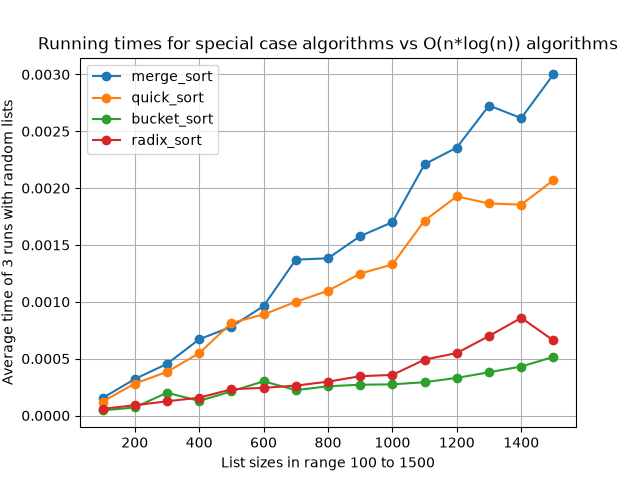
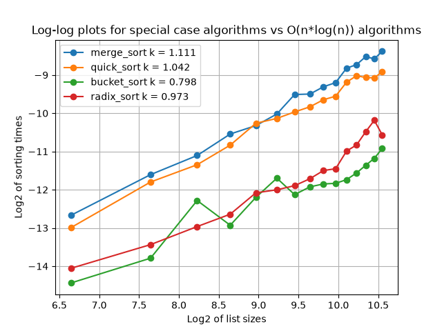

# Del 2 - Utvärdering av specialfallsalgoritmer

## 1. Hur experimenten genomfördes

Jag testade fyra sorteringsalgoritmer: merge sort, quick sort, bucket sort och radix sort.

Jag genererade 15 olika liststorlekar, från 100 till 1500 tal, i steg om 100. Listorna innehöll slumpmässiga tal.

För varje storlek kördes alla fyra algoritmerna tre gånger, och tiden mättes med Pythons `time.perf_counter()`. Medelvärdet av de tre körningarna användes sedan i resultaten.

Jag gjorde också en log-log-analys. Både liststorlekarna och tiderna logaritmerades, och en rät linje anpassades till punkterna med minsta kvadratmetoden.

## 2. Resultat och jämförelse

Bucket sort och radix sort var klart snabbare än merge sort och quick sort över hela intervallet. Skillnaden växer med liststorleken, vilket tyder på att specialfallsalgoritmerna skalar bättre.

Att bucket sort och radix sort är snabbare beror på att de inte jämför element med varandra, utan istället placerar talen direkt baserat på deras värde (bucket sort) eller siffror (radix sort).

Bucket sort var genomgående snabbast i experimentet. Det beror troligen på att listorna som genererades hade ett jämnt spritt intervall av tal, talen fördelas jämnt över hinkarna och varje hink blir liten att sortera. Radix sort låg strax bakom, eftersom den måste göra flera pass genom listan (ett per siffra i det största talet).

## 3. Matematisk förklaring

Bucket sort och radix sort är, under gynnsamma förhållanden (jämnt fördelade tal respektive tal med begränsat antal siffror), linjära i tidskomplexitet:

$$
T(n) = c \cdot n
$$

Tar man logaritmen av båda sidor får man:

$$
\log(T(n)) = \log(c) + \log(n)
$$

Detta är ekvationen för en rät linje med lutningen $k = 1$. Eftersom merge sort och quick sort har lutningen $k \approx 1$ också (se del 2, där $n \log(n)$ ger en lutning strax över $1$), blir skillnaden mellan de fyra algoritmerna i en log-log-plot svår att se på lutningen ensam – istället är det konstanten $c$ (avståndet mellan kurvorna, alltså $\log(c)$) som skiljer dem åt.

Genom att plotta $\log_2(\text{liststorlek})$ mot $\log_2(\text{körtid})$ för varje algoritm, och anpassa en rät linje till punkterna med minsta kvadratmetoden (`lin_reg`), fick jag ut lutningen $k$ för varje algoritm:

- merge_sort: $k = 1{,}111$
- quick_sort: $k = 1{,}042$
- bucket_sort: $k = 0{,}798$
- radix_sort: $k = 0{,}973$

Alla fyra värden ligger i närheten av $1$, vilket är väntat eftersom alla fyra algoritmer växer nära linjärt (eller nära $n \log n$) inom det testade intervallet. Bucket sorts lutning på $0{,}798$ är något lägre än den teoretiska förväntan på $1$, vilket sannolikt beror på att körtiderna för små listor är så korta att de blir känsliga för brus (t.ex. andra processer på datorn), vilket påverkar regressionen mer än för de långsammare algoritmerna.

## 4. Hur algoritmerna funkar

### Bucket Sort

- Ett antal tomma hinkar skapas, en per tal i listan.
- Varje tal placeras i en hink baserat på sitt värde: talets position i intervallet mellan minsta och största talet i listan avgör vilken hink det hamnar i.
- Varje hink sorteras för sig med en enkel sorteringsmetod (Pythons inbyggda sort).
- Till sist töms hinkarna i ordning, från första till sista, och talen läggs efter varandra i en ny lista.
- Eftersom hinkarna redan ligger i rätt ordning, och varje hink är sorterad internt, blir hela listan sorterad när hinkarna töms i tur och ordning.

### Radix Sort

- Talen delas först upp i negativa och positiva, eftersom metoden bygger på att jämföra siffror och negativa tal behöver hanteras separat.
- De positiva (och de positiva versionerna av de negativa) talen sorteras siffra för siffra, med start på entalssiffran.
- För varje siffra placeras talen i en av tio hinkar (0–9) baserat på den aktuella siffrans värde.
- Hinkarna töms i ordning tillbaka till listan, och processen upprepas för nästa siffra (tiotal, hundratal, och så vidare) tills alla siffror i det största talet har hanterats.
- Eftersom varje pass sorterar stabilt på en siffra i taget, och man går från minst till mest betydelsefull siffra, hamnar hela listan i rätt ordning när sista siffran har sorterats.
- De negativa talen sorteras till sist på samma sätt, och läggs i omvänd ordning framför de positiva talen.